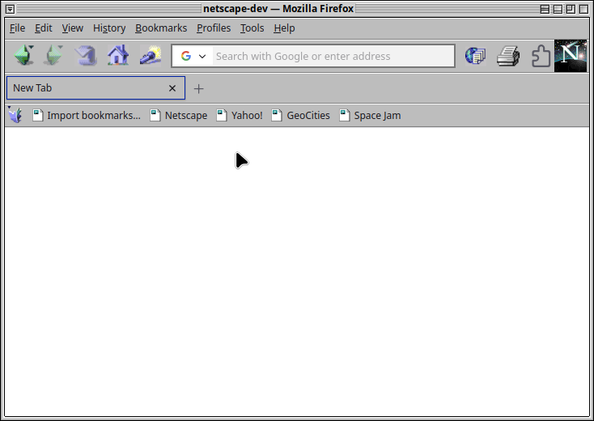

# netscape-4-firefox
A `userChrome.css` theme that brings the classic, nostalgic aesthetic of Netscape Navigator 4.0 to your modern Firefox browser.
> **Note:** Created and tested for Firefox 152.0.3, future Firefox updates may break functionality

## What does this theme do?

## Installation

### ⚠️ Important Prerequisite
*Before applying this theme, you **must** set your Firefox theme to "Light" or it will not render correctly.*
This is only for the UI and you can still have the "Website appearance" set to "Dark" independently.
   - Open Firefox Settings.
   - Go to **Extensions & Themes**.
   - Select the **Light** system theme.

1. **Open your Profile Folder:**
   - Type `about:support` in the Firefox URL bar and press enter.
   - Look for the **Profile Directory** row and click **Open Directory**.

2. **Create the Chrome folder:**
   - Inside that folder, create a new folder named `chrome` (if one doesn't already exist).

3. **Add the theme:**
   - Place `userChrome.css` and the `images` folder from this repository inside the `chrome` folder.

4. **Enable Customization:**
   - Type `about:config` in the Firefox URL bar and press enter.
   - Click "Accept the Risk and Continue."
   - Search for `toolkit.legacyUserProfileCustomizations.stylesheets`.
   - Toggle it to **true**.

5. **Restart:**
   - Restart Firefox to see your new Netscape look!

## License
GNU General Public License Version 3 (GPLv3)
